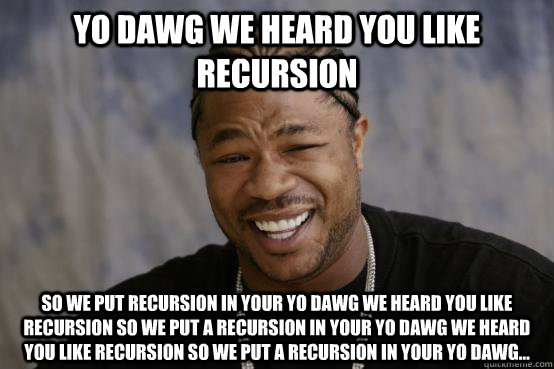
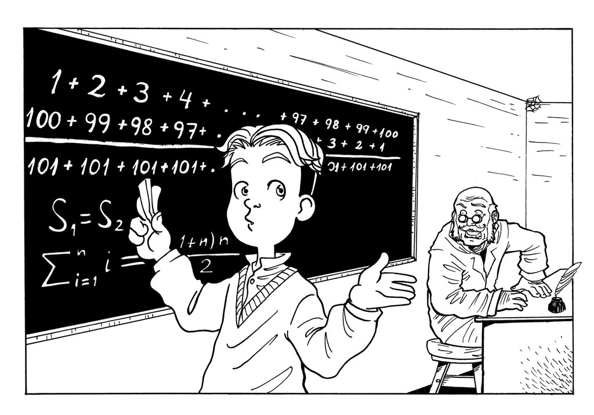
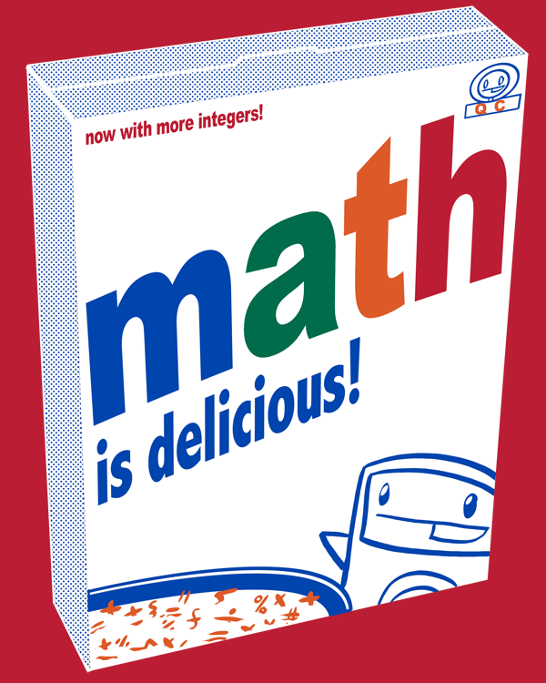
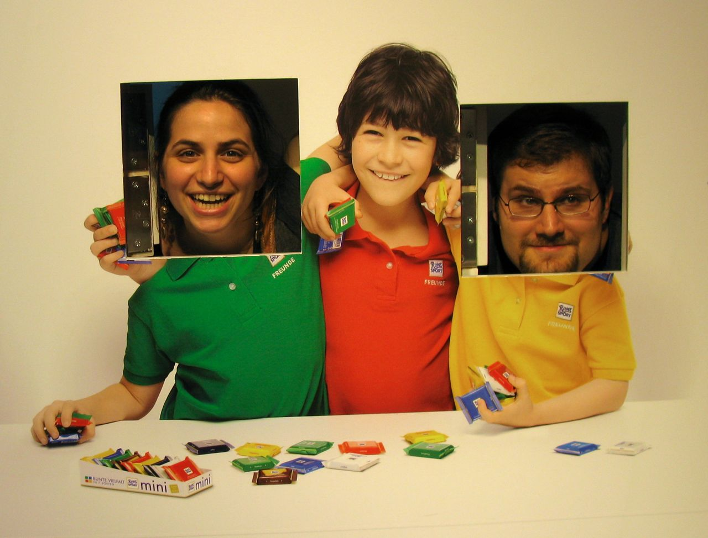

# Hello Pivotal!
You are helping me make this talk more awesome.
Questions and comments are appreciated either now or later by emailing
me at daniela.wellisz@gmail.com

### Things I'd love advice about

* Any awesome pictures or comics that this talk makes you think about
* Questions you think could be answered in my talk.

# Why is a Math Proof like a Unit Test?

# A Bit about me

# What I love about math

# How I got started

# Inspiration for this talk
# This:
    @@@ ruby
    { a: 
      { b:
        { c: 'd' },
        { e: 'f' }
      },
      g: 'h'
    }

## Into this: 
    
    @@@ ruby
    [
      [[ :a, :b, :c ], 'd'],
      [[ :a, :b, :e ], 'f'],
      [[ :g ], 'h']
    ]

# Oh boy do we ever use recursion!

# Introduction to Induction

    @@@ ruby
    describe 'proving that sum_up_to(n) == n(n + 1)/2' do
      it 'should be true for i=1' do
        sum_up_to(1).should == (1*2)/2
      end

      it 'should be true for n+1 if it is true for n' do
        n = Integer.new
        stub(sum_up_to(n)) { n(n + 1) / 2 }
        sum_up_to(n + 1).should == (n + 1)(n + 2) / 2
      end
    end

# Induction is not possible in RSpec

# Introduction to Induction

    @@@ ruby
    describe 'proving that sum_up_to(n) == n(n + 1)/2' do
      it 'should be true for i=1' do
        sum_up_to(1).should == (1*2)/2
      end

      it 'should be true for n+1 if it is true for n' do
        n = Integer.new
        stub(sum_up_to(n)) { n(n + 1) / 2 }
        sum_up_to(n + 1).should == (n + 1)(n + 2) / 2
      end
    end

# Summation Notation

$$\sum_{i=1}^n i = 1 + 2 + 3 + \ldots + n$$

<pre class='cr'>:::ruby
def sum_up_to(n)
  return 1 if n == 1
  n + sum_up_to(n-1) if n > 1
end
</pre>

$$\sum_{i=1}^n i$$

<!SLIDE big>

Prove $\sum_{i=1}^n i = \frac{n(n+1)}2$ for all $n$

<!SLIDE>
### Visual Proof

<ol class='right'>
  <li>&nbsp;</li>
  <li>&nbsp;</li>
  <li>&middot;</li>
  <li>&middot;&middot;</li>
  <li>&middot;&middot;&middot;</li>
  <li>&middot;&middot;&middot;&middot;</li>
  <li>&middot;&middot;&middot;&middot;&middot;</li>
  <li>&middot;&middot;&middot;&middot;&middot;&middot;</li>
  <li>&middot;&middot;&middot;&middot;&middot;&middot;&middot;</li>
  <li class='numbers'>1+ 2+ 3+ 4
    + 5+ 6+ 7</li>
</ol>

+

<ol class='left'>
  <li class='numbers'>7 +6 +5 +4 +
    3 +2 +1</li>
  <li>&middot;&middot;&middot;&middot;&middot;&middot;&middot;</li>
  <li>&middot;&middot;&middot;&middot;&middot;&middot;</li>
  <li>&middot;&middot;&middot;&middot;&middot;</li>
  <li>&middot;&middot;&middot;&middot;</li>
  <li>&middot;&middot;&middot;</li>
  <li>&middot;&middot;</li>
  <li>&middot;</li>
</ol>

&#x21fe;

}8 = n+1

}
7 = n

# Little Gauss

 

<!SLIDE>

<h2>For $n=1$:</h2>

$$\sum_{i=1}^1 i == 1 == \frac{1*2}2$$

    @@@ ruby
    it 'should be true for i=1' do
      sum_up_to(1).should == (1*2)/2
    end

<!SLIDE>

<h2>Assume $\sum_{i=1}^n i = \frac{n(n+1)}2$ for some n:</h2>

<table class='math'>
<tr class='top'>
  <td>$\sum_{i=1}^{n+1}i$ </td>
  <td>==</td>
  <td>$(n+1) + \sum_{i=1}^{n}i$</td>
</tr>
<tr class='waiting'>
  <td>$(n+1) + \sum_{i=1}^{n}i$</td>
  <td>==</td>
  <td>$(n+1) + $$\frac{n(n+1)}2$</td>
</tr>
<tr>
  <td>$(n+1) + $$\frac{n(n+1)}2$</td>
  <td>==</td>
  <td class='frac moveUp'>$\frac{2(n+1)}2+\frac{n(n+1)}2 $</td>
</tr>
<tr>
  <td class='frac moveUp'>$\frac{2(n+1)}2+\frac{n(n+1)}2 $</td>
  <td>==</td>
  <td class='frac'>$\frac{n(n+1) + 2(n+1)}2$</td>
</tr>
<tr>
  <td class='frac'>$\frac{n(n+1) + 2(n+1)}2$</td>
  <td>==</td>
  <td class='frac'>$\frac{(n+2)(n+1)}2 $</td>
</tr>
<tr class='want'>
  <td>$\sum_{i=1}^{n+1}i$&nbsp;&nbsp; should </td>
  <td>==</td>
  <td class='frac'>$\frac{(n+1)(n+2)}2 $</td>
</tr>
</table>

# The Integers!

# Axiom of Induction

Given a set S where:

* 0 is in S
* For a natural number n, if n is in S, n + 1 is in S

Then S contains every natural number.

# Our 'Proof' Again:

<pre style='color: red' class='fadein no_method'>
NoMethodError: undefined method `new' for Integer:Class
</pre>

    @@@ ruby
    describe 'proving that sum_up_to(n) == n(n + 1)/2' do
      it 'should be true for i=1' do
        sum_up_to(1).should == (1*2)/2
      end

      it 'should be true for n+1 if it is true for n' do
        n = Integer.new

      end
    end

# We are having difficulties

    @@@ ruby
    require 'impossible'

    describe 'proving that sum_up_to(n) == n(n + 1)/2' do
      it 'should be true for i=1' do
        sum_up_to(1).should == (1*2)/2
      end

      it 'should be true for n+1 if it is true for n' do
        n = Integer.new
        stub(sum_up_to(n)) { n(n + 1) / 2 }
        sum_up_to(n + 1).should == (n + 1)(n + 2) / 2
      end
    end

<!SLIDE padded>

# Everything in Ruby is an Object

# You cannot represent the Platonic Ideal of an Integer in Ruby

# All we can really do in RSpec

    @@@ ruby
    it 'sum_up_to(n) should be n(n + 1)/2' do
      20.times do |n|
        n += 1
        sum_up_to(n + 1).should == (n + 1)(n + 2) / 2
      end
    end

<!SLIDE padded>

## Why not prove things in RSpec?

<!SLIDE big>
Unit tests are heuristics rather than proofs
<!SLIDE big>
Proofs by induction rely heavily on being able to use a stand-in integer
<!SLIDE big>
Integers in Ruby always come with context.
  

# Obligatory Cat Photo Slide

# Would you tutor these kids?

# How To Solve It

_George Polya_ (1888-1985)

<!SLIDE padded>

> It is foolish to answer a question you do not understand. It is sad to
> work for an end you do not desire.

<!SLIDE padded>

    @@@ ruby
    describe 'When you follow the yellow brick road' do
      before do
        visit '/yellow_brick_road'
      end

      it 'you can defeat a flying monkey' do
        click_link 'Battle Evil'
        FlyingMonkey.last.should be_defeated
      end
    end

<!SLIDE padded>

> If you can't solve a problem, then there is an easier problem you
> can't solve. Find it.  - Polya

<!SLIDE>

<pre style='color:red'>
     Failure/Error: visit '/yellow_brick_road'
     ActionController::RoutingError:
       No route matches [GET] "/yellow_brick_road"
</pre>

<pre style='color:red'>
     Failure/Error: visit '/yellow_brick_road'
     ActionController::RoutingError:
       uninitialized constant YellowBrickRoadController
</pre>

<pre style='color:red'>
     Failure/Error: visit '/yellow_brick_road'
     AbstractController::ActionNotFound:
       The action 'index' could not be found for YellowBrickRoadController
</pre>

<pre style='color:red'>
     Failure/Error: visit '/yellow_brick_road'
     ActionView::MissingTemplate:
       Missing template yellow_brick_road/index, application/index with {:handlers=>[:erb, :builder, :coffee, :haml], :formats=>[:html], :locale=>[:en, :en]}. Searched in:
         * "~/oz/app/views"
</pre>

<!SLIDE big>

## In conclusion:

<!SLIDE big>

Approaching tasks in small chunks is more logical and mathematical

<!SLIDE big>

Test Driven Development is a good learning tool for the mathematically minded

<!SLIDE big>

Understanding the heuristics behind a subject increases our ability to impart knowledge

# THANK YOU!

Follow me at @alenia

Any comments much appreciated. Please email me at:
daniela.wellisz@gmail.com

Say 'Hello' next time you're in SF!

#### Comic credits:

* Purity by Randall Monroe, XKCD
* Little Gauss by Horusart on DeviantArt
* Math is Delicious t-shirt design, Jeph Jaques, questionablecontent.net
