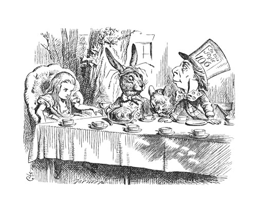
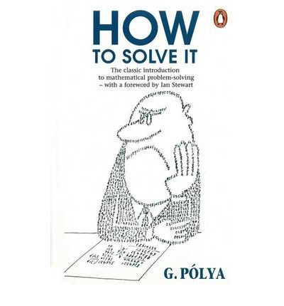

# Why is a Math Proof like a Unit Test?

Better known as Lewis Carroll

# A Bit about me

# What I love about math

# How I got started

# Inspiration for this talk
# This:
    @@@ ruby
    { a: 
      { b:
        { c: 'd' },
        { e: 'f' }
      },
      g: 'h'
    }

## Into this: 
    
    @@@ ruby
    [
      [[ :a, :b, :c ], 'd'],
      [[ :a, :b, :e ], 'f'],
      [[ :g ], 'h']
    ]

# Introduction to Induction

Pardon my pseudo-code!

    @@@ ruby
    describe 'proving that sum(n) == n*(n + 1)/2' do
      it 'should be true for i=1' do
        sum(1).should == (1*2)/2
      end

      it 'should be true for n+1 if it is true for n' do

        stub(sum(n)) { n*(n + 1) / 2 }
        sum(n + 1).should == (n + 1)*(n + 2) / 2
      end
    end

(Visit http://github.com/alenia/mathese/lib/basic_sum.rb for an
example stubbable object!)

# Summation Notation

$$\sum_{i=1}^n i = 1 + 2 + 3 + \ldots + n$$

    @@@ ruby
    def sum(n)
      return 1 if n == 1
      n + sum(n-1) if n > 1
    end

# Summation Notation

$$\sum_{i=1}^n f(i) = f(1) + f(2) + f(3) + \ldots + f(n)$$

    @@@ ruby
    def sum(n, func)
      return func[1] if n == 1
      func[n] + sum(n-1) if n > 1
    end

<!SLIDE>
### Visual Proof

<ol class='right'>
  <li>&nbsp;</li>
  <li>&nbsp;</li>
  <li>&middot;</li>
  <li>&middot;&middot;</li>
  <li>&middot;&middot;&middot;</li>
  <li>&middot;&middot;&middot;&middot;</li>
  <li>&middot;&middot;&middot;&middot;&middot;</li>
  <li>&middot;&middot;&middot;&middot;&middot;&middot;</li>
  <li>&middot;&middot;&middot;&middot;&middot;&middot;&middot;</li>
  <li class='numbers'>1+ 2+ 3+ 4
    + 5+ 6+ 7</li>
</ol>

+

<ol class='left'>
  <li class='numbers'>7 +6 +5 +4 +
    3 +2 +1</li>
  <li>&middot;&middot;&middot;&middot;&middot;&middot;&middot;</li>
  <li>&middot;&middot;&middot;&middot;&middot;&middot;</li>
  <li>&middot;&middot;&middot;&middot;&middot;</li>
  <li>&middot;&middot;&middot;&middot;</li>
  <li>&middot;&middot;&middot;</li>
  <li>&middot;&middot;</li>
  <li>&middot;</li>
</ol>

&#x21fe;

}n+1

}
n

# Introduction to Induction

Prove $\sum_{i=1}^n i = \frac{n*(n+1)}2$ for all $n$

    @@@ ruby
    describe 'proving that sum(n) == n*(n + 1)/2' do
      it 'should be true for i=1' do
        sum(1).should == (1*2)/2
      end

      it 'should be true for n+1 if it is true for n' do
        stub(sum(n)) { n*(n + 1) / 2 }
        sum(n + 1).should == (n + 1)*(n + 2) / 2
      end
    end

<!SLIDE>

<h2>For $n=1$:</h2>

$$\sum_{i=1}^1 i == 1 == \frac{1*2}2$$

    @@@ ruby
    it 'should be true for i=1' do
      sum(1).should == (1*2)/2
    end

<!SLIDE>

<h2>Assume $\sum_{i=1}^n i = \frac{n*(n+1)}2$ for some n:</h2>

<table class='math'>
<tr class='top'>
  <td>$\sum_{i=1}^{n+1}i$ </td>
  <td>==</td>
  <td>$(n+1) + \sum_{i=1}^{n}i$</td>
</tr>
<tr class='middle'>
  <td>$(n+1) + \sum_{i=1}^{n}i$</td>
  <td>==</td>
  <td>$(n+1) + $$\frac{n*(n+1)}2$</td>
</tr>
<tr class='waiting'>
  <td>$(n+1) + $$\frac{n*(n+1)}2$</td>
  <td>==</td>
  <td class='frac moveUp'>$\frac{n*(n+1) + 2*(n+1)}2 $</td>
</tr>
<tr>
  <td class='frac'>$\frac{n*(n+1) + 2*(n+1)}2$</td>
  <td>==</td>
  <td class='frac'>$\frac{n^2 + 3*n + 2}2 $</td>
</tr>
<tr>
  <td class='frac'>$\frac{n^2 + 3*n + 2}2$</td>
  <td>==</td>
  <td class='frac'>$\frac{(n+1)(n+2)}2 $</td>
</tr>
</table>

# All we can really do in RSpec

    @@@ ruby
    it 'sum(n) should be n*(n + 1)/2' do
      20.times do |n|
        n += 1
        sum(n + 1).should == (n + 1)*(n + 2) / 2
      end
    end

# Crazy awesome picture filler slide

# How To Solve It

_George Polya_ (1888-1985)

<!SLIDE>

> It is foolish to answer a question you do not understand. It is sad to
> work for an end you do not desire.

<!SLIDE>

    @@@ ruby
    describe 'When you follow the yellow brick road' do
      before do
        visit '/yellow_brick_road'
      end

      it 'you can defeat a flying monkey' do
        click_link 'Battle Evil'
        FlyingMonkey.last.should be_defeated
      end
    end

<!SLIDE>

> If you can't solve a problem, then there is an easier problem you
> can't solve. Find it.  - Polya

<!SLIDE>

<pre style='color:red'>
     Failure/Error: visit '/yellow_brick_road'
     ActionController::RoutingError:
       No route matches [GET] "/yellow_brick_road"
</pre>

<pre style='color:red'>
     Failure/Error: visit '/yellow_brick_road'
     ActionController::RoutingError:
       uninitialized constant YellowBrickRoadController
</pre>

<pre style='color:red'>
     Failure/Error: visit '/yellow_brick_road'
     AbstractController::ActionNotFound:
       The action 'index' could not be found for YellowBrickRoadController
</pre>

<pre style='color:red'>
     Failure/Error: visit '/yellow_brick_road'
     ActionView::MissingTemplate:
       Missing template yellow_brick_road/index, application/index with {:handlers=>[:erb, :builder, :coffee, :haml], :formats=>[:html], :locale=>[:en, :en]}. Searched in:
         * "~/oz/app/views"
</pre>

# Some better closing quote or image
 or don't people put a twitter handle here?
